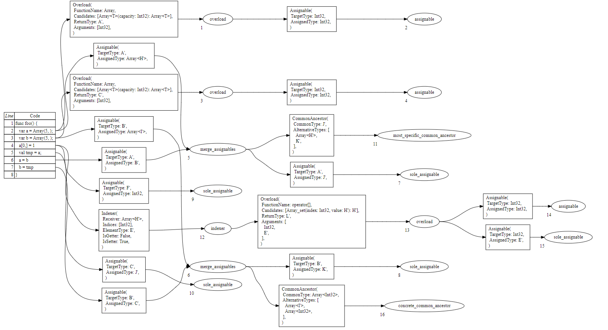
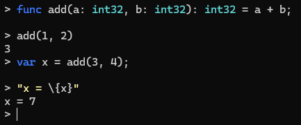
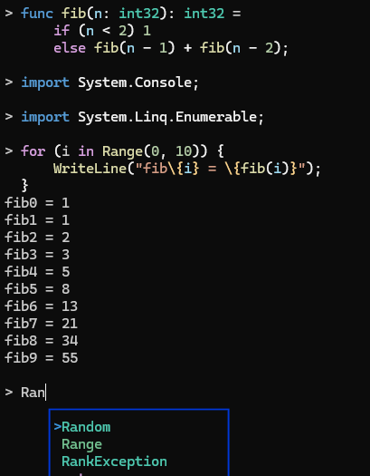
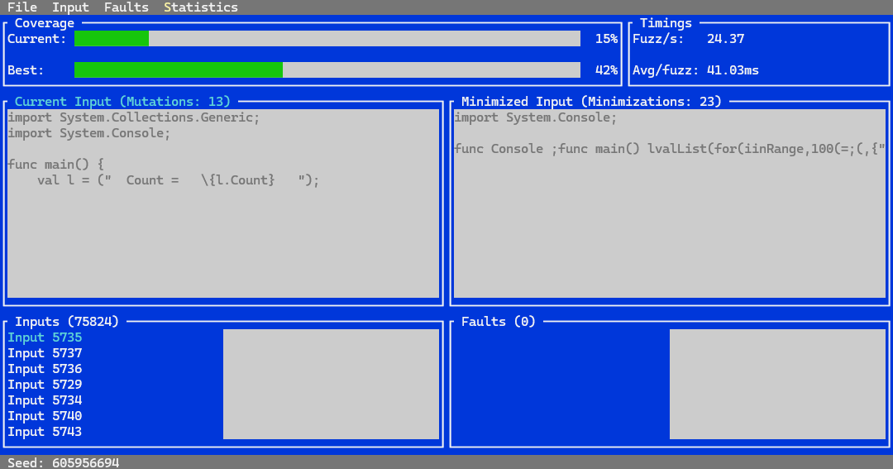

It's been a year since our last blog post, so it's time for another retrospective to see what we managed to achieve in a year. The year had its ups and downs, people getting interested and disinterested in the project and phases of burnout, but we managed to put together enough progress to justify a blogpost about it.

## Right after the first birthday

With motivations still high, we jumped right back into working on the compiler.

- 2023 13th of October: Stackification complete in the code-generation backend

This was a very important step that made the generated IL code much more tidy. The intermediate representation we translate to is register-based, but then we have to translate that to the stack-based MSIL code. Originally we took the lazy approach and allocated a lot of local variables. Only used the stack to move in and out of these local "registers". The algorithm we decided to use was inspired by [this gist](https://gist.github.com/evanw/58a8a5b8b4a1da32fcdcfbf9da87c82a), which is a simplified version of how LLVM does it for WASM.

To see what this stackification algorithm did to our MSIL code generation, let's look at a simple Draco program:

```draco
import System.Console;

func main() {
    var i = 0;
    while (i < 10) {
        WriteLine("\{i}^2 = \{i * i}");
        i += 1;
    }
}
```

Before the stackification algorithm was introduced, it compiled to the following MSIL code:

```msil
.method private hidebysig static 
	void main () cil managed 
{
	// Method begins at RVA 0x2050
	// Header size: 12
	// Code size: 154 (0x9a)
	.maxstack 8
	.entrypoint
	.locals (
		[0] int32 i,
		[1] object[] '',
		[2] int32,
		[3] bool,
		[4] bool,
		[5] object[],
		[6] int32,
		[7] object[],
		[8] object,
		[9] int32,
		[10] int32,
		[11] int32,
		[12] object[],
		[13] object,
		[14] object[],
		[15] string,
		[16] int32,
		[17] int32
	)

	IL_0000: nop
	IL_0001: ldc.i4.0
	IL_0002: stloc.0
	IL_0003: br IL_0008
	// loop start (head: IL_0008)
		IL_0008: nop
		IL_0009: ldloc.0
		IL_000a: stloc.2
		IL_000b: ldloc.2
		IL_000c: ldc.i4.s 10
		IL_000e: clt
		IL_0010: stloc.3
		IL_0011: ldloc.3
		IL_0012: ldc.i4.0
		IL_0013: ceq
		IL_0015: stloc.s 4
		IL_0017: ldloc.s 4
		IL_0019: brtrue IL_0098

		IL_001e: br IL_0023

		IL_0023: nop
		IL_0024: nop
		IL_0025: ldc.i4.2
		IL_0026: newarr [System.Runtime]System.Object
		IL_002b: stloc.s 5
		IL_002d: ldloc.s 5
		IL_002f: stloc.1
		IL_0030: ldloc.0
		IL_0031: stloc.s 6
		IL_0033: ldloc.1
		IL_0034: stloc.s 7
		IL_0036: ldloc.s 6
		IL_0038: box [System.Runtime]System.Int32
		IL_003d: stloc.s 8
		IL_003f: ldloc.s 7
		IL_0041: ldc.i4.0
		IL_0042: ldloc.s 8
		IL_0044: stelem [System.Runtime]System.Object
		IL_0049: ldloc.0
		IL_004a: stloc.s 9
		IL_004c: ldloc.0
		IL_004d: stloc.s 10
		IL_004f: ldloc.s 9
		IL_0051: ldloc.s 10
		IL_0053: mul
		IL_0054: stloc.s 11
		IL_0056: ldloc.1
		IL_0057: stloc.s 12
		IL_0059: ldloc.s 11
		IL_005b: box [System.Runtime]System.Int32
		IL_0060: stloc.s 13
		IL_0062: ldloc.s 12
		IL_0064: ldc.i4.1
		IL_0065: ldloc.s 13
		IL_0067: stelem [System.Runtime]System.Object
		IL_006c: ldloc.1
		IL_006d: stloc.s 14
		IL_006f: ldstr "{0}^2 = {1}"
		IL_0074: ldloc.s 14
		IL_0076: call string [System.Runtime]System.String::Format(string, object[])
		IL_007b: stloc.s 15
		IL_007d: ldloc.s 15
		IL_007f: call void [System.Console]System.Console::WriteLine(string)
		IL_0084: nop
		IL_0085: ldloc.0
		IL_0086: stloc.s 16
		IL_0088: ldloc.s 16
		IL_008a: ldc.i4.1
		IL_008b: add
		IL_008c: stloc.s 17
		IL_008e: ldloc.s 17
		IL_0090: stloc.0
		IL_0091: nop
		IL_0092: nop
		IL_0093: br IL_0008
	// end loop

	IL_0098: nop
	IL_0099: ret
} // end of method FreeFunctions::main
```

There are lots of redundant stack operations to handle the locals as registers. With stackification enabled, all that disappears:

```msil
.method private hidebysig static 
	void main () cil managed 
{
	// Method begins at RVA 0x2050
	// Header size: 12
	// Code size: 106 (0x6a)
	.maxstack 8
	.entrypoint
	.locals (
		[0] int32 i,
		[1] object[] '',
		[2] int32,
		[3] object[],
		[4] int32,
		[5] object[]
	)

	IL_0000: nop
	IL_0001: ldc.i4.0
	IL_0002: stloc.0
	IL_0003: br IL_0008
	// loop start (head: IL_0008)
		IL_0008: nop
		IL_0009: ldloc.0
		IL_000a: ldc.i4.s 10
		IL_000c: clt
		IL_000e: ldc.i4.0
		IL_000f: ceq
		IL_0011: brtrue IL_0068

		IL_0016: br IL_001b

		IL_001b: nop
		IL_001c: nop
		IL_001d: ldc.i4.2
		IL_001e: newarr [System.Runtime]System.Object
		IL_0023: stloc.1
		IL_0024: ldloc.0
		IL_0025: stloc.2
		IL_0026: ldloc.1
		IL_0027: stloc.3
		IL_0028: ldloc.3
		IL_0029: ldc.i4.0
		IL_002a: ldloc.2
		IL_002b: box [System.Runtime]System.Int32
		IL_0030: stelem [System.Runtime]System.Object
		IL_0035: ldloc.0
		IL_0036: ldloc.0
		IL_0037: mul
		IL_0038: stloc.s 4
		IL_003a: ldloc.1
		IL_003b: stloc.s 5
		IL_003d: ldloc.s 5
		IL_003f: ldc.i4.1
		IL_0040: ldloc.s 4
		IL_0042: box [System.Runtime]System.Int32
		IL_0047: stelem [System.Runtime]System.Object
		IL_004c: ldstr "{0}^2 = {1}"
		IL_0051: ldloc.1
		IL_0052: call string [System.Runtime]System.String::Format(string, object[])
		IL_0057: call void [System.Console]System.Console::WriteLine(string)
		IL_005c: nop
		IL_005d: ldloc.0
		IL_005e: ldc.i4.1
		IL_005f: add
		IL_0060: stloc.0
		IL_0061: nop
		IL_0062: nop
		IL_0063: br IL_0008
	// end loop

	IL_0068: nop
	IL_0069: ret
} // end of method FreeFunctions::main
```

- 2023 17th of October: Support for type aliases in the compiler

Right now, this feature isn't exposed to the end user, but it could be if we decide to. Technically all that's stopping us is adding it to the specification and add a syntax for it. Currently, this is used to alias well-known primitive types from the standard library. This way, the user can type `int32` instead of `System.Int32` for example, similar to C# primitives.

- 2023 21st of October: LSP and DAP communication refactor
- 2023 27th of October: Crash bug fix for LSP cancellation
- 2023 29th of October: Formatter rework, diagnostic bag fixes, and character literals
- 2023 22nd of November: PowerShell script fixes

After a bunch of fixes we added a small feature that was missing, character literals! They are similar to the C# character literals. The only major difference is the Unicode code point escape sequence, which is in the format `'\u{123ABC}'`, as it is in Draco string literals.

## Cutting down the trees

Internally, we had 3 major tree representations in the compiler:
 1. Syntax tree: This is pretty self-explanitory, it directly contains the parsed source code without throwing out any details. Even comments and whitespaces are stored as trivia around the tokens.
 2. Untyped tree: The reason for this will be explained below, but here is a slight hint: Roslyn does not need this and we only need this because of the amount of type-inference we do.
 3. Bound tree: This is essentially the abstract syntax tree, with known types and resolved symbols. The flow analysis, lowering and code generation can work off of this tree.

So what's up with that untyped tree? Since we do full function-local type inference, we can't always know in a single pass what kind of node to construct or what the type of something is. For example, looking at the following Draco code:

```draco
func main() {
    // assuming the existence of a func default<T>(): T
    val x = default();
    val y = x.Successor();
    x = 5;
}
```

Initially, the type of `x` is unknown. When trying to look at the next line, we call a method called `Successor()` on it. We have no way to resolve the called symbol, until we have more information about the type — which only appears at the next line. The bound tree would expect to know all the symbols and types at this point, so we can't create a bound tree from this right away. This is why we introduced an awkward in-between state, something more abstract than the syntax tree, but with less type and symbolic information than the bound tree.

This caused plenty of pain-points around type checking. For example, the rough flow of checking if a `for` loop is type-safe and valid is the following.

 1. Check what the type of the iterated collection is and call it `TCollection`.
 2. Check if `TCollection` has a method called `GetEnumerator()` which returns a type `TEnumerator`.
 3. Check if `TEnumerator` has a method called `MoveNext()` which returns a `bool`.
 4. Check if `TEnumerator` has a property called `Current` which returns a type `TElement`.
 5. Check if `Telement` is assignable to the type of the loop variable if it's explicitly typed.

Imagine that we could not infer the exact type of the collection yet. How do we check if it has a method called `GetEnumerator()`? We can't! The solution? Introducing various kinds of sentinel, delay and placeholder nodes in the untyped tree, with the sole purpose of pushing back the check, evaluation or node construction to the point where we have more information available from future code. With this mentality, the untyped tree basically became an incomplete copy of the bound tree, with nodes such as `UntypedLocalExpression` or `UntypedDelayedExpression`.

This caused multiple maintainability issues. First off, binding essentially had to be written twice. Once when translating the syntax tree to untyped trees, and then the untyped trees to bound trees — with the constraint solver invoked in between for more type information. Second, the code became multiply nested with callbacks. It was not uncommon to see this:

```cs
var sequenceExpr = new UntypedDelayedExpression(sequence.Type, () =>
{
    var memberConstraint = constraintSolver.MemberConstraint(sequence.Type, "GetEnumerator");
    return new UntypedDelayedExpression(memberConstraint, () =>
    {
        // ...
    });
});
```

And finally, if we ever had to do type checks on a node, we had to take into account that it could be one of the placeholders or delays, and had to wrap that logic into a delay node to deal with this.

If you have ever seen [asynchronous JavaScript code](https://www.stoman.me/articles/async-await-promises-callbacks-in-javascript) before async/await was added, this might look familiar to you. This is the exact same problem! When we don't know something yet, it would be awesome to suspend the evaluation of the current node, continue binding other nodes, or even evaluate some constraints in the constraint solver. I told this to [Kuinox](https://github.com/Kuinox/), who immediately got to work, and not even an hour later presented the prototype: binding tasks, that work exactly like JavaScript async callbacks.

We started reworking the binding to use async/await with these tasks, binding the syntax tree and immediately constructing a bound tree, skipping the untyped tree entirely. The work was quite nerve wracking, as I had no idea if this was gonna work how I imagined it, if we'd hit an impossible edge case we didn't account for and all the work was for nothing. After a month of hard work, probably [one of my favorite PRs](https://github.com/Draco-lang/Compiler/pull/344) got merged on the 28th of November. It async-ified our binding logic and got rid of:
 * All of the untyped tree
 * All of the logic needed to bridge the untyped tree to the bound tree
 * Lots of nesting complexity
 * Lots of node-type checks in the binder code

This was one of the largest tech debt items, and we had been carrying it for quite a while. It made introducing and debugging features quite painful, and now it's gone. The async-ified version turned out better than what I could have ever imagined.

## A challenging end of 2023 and start of 2024

The project hit one of its longest inactive gaps yet. To keep personal matters short, I was feeling quite burnt out on working on personal projects along with a full-time .NET developer job. I needed to find other hobbies to mentally recharge and regather my motivation for the project. During this time, Kuinox stepped in again and carried the project on his shoulders so that it wasn't abandoned. I'm infinitely grateful for everyone who contributed during this time and special thanks to him for holding the project together for as long as I needed.

- 2023 28th of November: Additional utility PowerShell scripts
- 2023 5th of December: Fix a bug with spaces in paths in the SDK integration
- 2023 14th of December: Publishing the Language Server Protocol and Debug Adapter protocol implementations to NuGet (people wanted to use our implementations!)
- 2023 16th of December: Cleanup around the symbol hierarchy
- 2023 22nd of December: CI workflow updates to the playground
- 2024 21st of January: PowerShell utility script improvements, and a bug fix in the language server to update a freshly opened document
- 2024 23rd of January: Playground build script improvement, and merging well-known types and intrinsic symbols

This last one deserves a few words of explanation. Almost all compilers will have a set of intrinsic symbols that the compiler needs to know about. Primitives, all the built-in operations, the base type for all objects, known types of certain operations, such as `System.Type` from `typeof(T)`, and so on. So far, we have represented these built-in types separately from the ones in `System`. For example, `int32` was actually a different type from `System.Int32`. This PR merged the two and got rid of a lot of ugly edge cases.

- 2024 24th of January: Better error reporting for cases where the well-known primitives can't be located, formatter bugfixes, and report an error when import declarations are qualified with a visibility modifier
- 2024 25th of January: Utility script fix
- 2024 27th of January: Reworked IO workers in the debugger which fixes a bug
- 2024 30th of January: Variance cleanup for symbol hierarchy
- 2024 31st of January: Publish JsonRpc as a package — which was needed to be able to actually reuse the LSP and DAP implementations
- 2024 7th of February: Upgrade to .NET 8
- 2024 11th of February: Fixes on the Playground
- 2024 18th of February: Basic debugger tests, and debugger tracing for VS Code extension
- 2024 23rd of February: Loading operators from metadata

Until this point the language could not use any user defined operators for a type. We needed to improve the lookup code to allow checking both operand types for the given operator, in addition to intrinsicly defined operators, and allow either of the lookups and resolutions to fail.

- 2024 25th of February: Multithreading improvements, and debugger bugfixes
- 2024 1st of May: Reworked how registers get allocated for intrinsic methods; fixes a bug
- 2024 1st of June: Lexer bugfixes
- 2024 3rd of June: Removed [stryker](https://github.com/stryker-mutator/stryker-net), as it wasn't really utilized

## Less debt, more stability

After a lengthy break with very few commits from me, I felt motivated again to jump back into working on the language and the compiler. I am generally very happy with spending time on other things I find joy in, and in the long term it made me appreciate this project even more. I decided that I'd like to focus on improving code quality, traceability and fix crash bugs in general. The next section contains mostly that, with occasional features sprinkled in.

- 2024 3rd of June: Migrated the Playground into a separate repository, as the compiler has a stable enough API at this point — it also got rid of the brittle JS toolchain needed to build the Playground, which was part of the solution
- 2024 8th of July: General codebase cleanup, and utilizing .NET 8 features like primary constructors
- 2024 13th of July: Basic project system, and LSP convenience methods

Until this point, the language server always assumed that a Draco project only uses the .NET BCL and did not resolve package references defined in the project file. The essence of the problem is locating the DLLs on the user's machine for the BCL and downloaded NuGet packages. We used a package called [Basic.Reference.Assemblies](https://www.nuget.org/packages/Basic.Reference.Assemblies/) in the language server that kept the .NET BCL in memory. This not only didn't look for package references, but it also locked us into the .NET version shipped with the package.

The solution was something called [design-time builds](https://github.com/dotnet/project-system/blob/main/docs/design-time-builds.md). After learning about them, we wrote a basic project system implementation that is able to perform a design-time build. This does things like restore and collects all the parameters that will be passed into the compiler, but does not actually invoke compilation. This allowed us to read out the metadata reference locations from the user's machine, and to finally get rid of the ugly hack of shipping the entire BCL metadata with the language server. Excitingly, for the first time the language server could finally make code suggestions for 3rd party packages!

- 2024 14th of July: CHR solver library

This has been on the back burner a long time. We have discussed before, how the current constraint solver for the type system is kind of hard to trace and reason about, and some uniform formalization could improve it drastically. [Constraint Handling Rules](https://en.wikipedia.org/wiki/Constraint_Handling_Rules) came to mind from my university days, and we decided to write a library that implements a .NET-hosted CHR solver. The compiler did't utilize CHR yet, but the library was merged into the repository for future use.

- 2024 16th of July: Refactor overload resolution
- 2024 17th of July: Passing down the cancellation token in the entire flow of the LSP/DAP implementations
- 2024 20th of July: Cancellation support for language client in LSP
- 2024 25th of July: Ship a few example programs with the compiler
- 2024 29th of July: Updates to the readme, it'd been obsolete for a long time
- 2024 5th of August: Rework the type system to use the CHR solver, default value intrinsic function

The solver we wrote a while back finally passed all of our regression testing, when integrated into the type system. This also brought things like better traceability, something that helped us trace down quite a few bugs. For example, the graph below was produced by the generic tracing capabilities of the CHR system.



- 2024 12th of August: Type system and overload resolution bugfixes
- 2024 13th of August: Language server fixes, and inlay hints for generics
- 2024 15th of August: Basic delegates

The language hadn't had any kind of first-class function support. This update brought in the most basic version of delegates, which can be stored in `System.Action` and `System.Func` types. There are still no lambdas or closures in the language, but named functions can be passed around as delegates now.

- 2024 20th of August: Internal API simplifications, crash fixes, and treat string escape sequences as separate tokens in string literals
- 2024 21st of August: Range-Span API cleanup for the syntax tree, and introduced a REPL

While my main focus was improvements, I've been finding myself using tools like [csharprepl](https://github.com/waf/CSharpRepl) more and more, so I really wanted to implement a REPL for Draco. After a little prototyping, the base REPL was working and can be installed with `dotnet tool install -g dracorepl`.



- 2024 22nd of August: REPL bugfixes, syntax highlighter service in the compiler, [PrettyPrompt](https://github.com/waf/PrettyPrompt) integration for the REPL, compiler concurrency bugfix, debugger bugfixes, and project system bugfixes (busy day, huh)

At this point, the REPL already looked and felt much nicer.



- 2024 24th of August: Crash bug fix
- 2024 25th of August: Removed the old fuzzer project, as it hadn't been used for a while and was not really useful. It was a simple, purely random input generator that didn't have any strategy.
- 2024 26th of August: REPL binder logic refactoring that removed quite a few limitation from the way it handles code
- 2024 27th of August: Integrated syntax highlighting and completion into the REPL
- 2024 28th of August: Design-time build fixes, crash bug fixes
- 2024 30th of August: Handle C heritage tokens in the parser to provide better error messages, general improvements and additions (like comparison operators for enums)
- 2024 31st of August: Test utility refactoring
- 2024 1st of September: Codegen simplifications, REPL fixes
- 2024 2nd of September: Lowering fix, to fix an order of evaluation bug
- 2024 7th of September: Basic attributes support, and compile-time execution and evaluation

At this point, I was quite unsure what to work on, so I decided to work towards our first actually interesting feature: macros. Our plan is that macros are going to be regular functions that take in some AST node and return some substitution AST node. The first step into this was giving the compiler the ability to execute — almost — arbitrary code at compile-time. This feature is still not exposed to the user, and probably will not be until we ship the first version of macros.

- 2024 8th of September: Crash fixes, local function codegen fix, project file highlighting for the VS Code extension
- 2024 10th of September: Source Generators rework. We had used [Scriban](https://github.com/scriban/scriban) for [Roslyn Source Generators](https://learn.microsoft.com/en-us/dotnet/csharp/roslyn-sdk/source-generators-overview), but the tooling support was less than ideal. We decided that with multiline raw string literals, there was no reason not to move the logic to regular C#.
- 2024 11th of September: Add `EmitCompilerGeneratedFiles` tag for VS Code users

## Bugs and crashes everywhere

Around this time I decided to do some dogfooding and use the language. For this I decided to use our VS Code integration and write the following 2 programs:
 * A CLI-based TODO list app
 * Port the compiler CLI from C# to Draco, at least partially

While working on these, I realized that the compiler was much more broken and easy to crash than I've ever imagined. The language server was really easy to crash with many unfinished code portions or partial edits. I decided that I would focus on crash fixes until the compiler and the tooling around it was rock solid.

- 2024 12th of September: Crash fix
- 2024 14th of September: Completion and signature provider services rework to make them more resilient
- 2024 15th of September: Codefix provider rework for resilience; crash fix
- 2024 16th of September: Run examples as part of the test suite

We have long had the ability to install the Draco SDK locally in a folder and we have discussed how nice it would be if we could run the examples as part of the test suite to test the entire SDK end-to-end. With this change, both the compiler test project and the CI runs the examples as part of the test suite. Locally, it can use an arbitrary installed SDK, while the CI uses the SDK installed directly from source. The outputs are verified using the wonderful [Verify](https://github.com/VerifyTests/Verify) library.

- 2024 20th of September: Bugfix in the parent–child relationship of `SyntaxList<T>` elements

## We need a fuzzer

Kuinox has long argued for a better [fuzzer](https://en.wikipedia.org/wiki/Fuzzing). The old fuzzer was nothing more than a structured random string generator and never produced anything more than a few messy test cases for the lexer. The problem? There is no decent fuzzer available in .NET and I thought writing one would be a massive time sink without significant payback. Kuinox has tried to fuzz the compiler with [sharpfuzz](https://github.com/Metalnem/sharpfuzz) and it caught a handful of lexer bugs, but nothing more of interest.

One long day after searching for bugs, I opened up the [wiki page for AFL](https://en.wikipedia.org/wiki/American_Fuzzy_Lop_(software)), a famous fuzzer. Reading about its high-level functionality, none of the components seemed that daunting so I've decided to give it a shot.

### Step 1: Instrumentation

A decent fuzzer needs to instrument the code. AFL looks at the coverage of the code being run to pick mutations that are more interesting to run. For us to do this, we'd need a way to measure the coverage of certain .NET code. Unfortunately, all code coverage libraries in .NET seem to assume that they'll be measuring code coverage running from a test host, providing no API.

Our first task was then to write a library that can add instrumentation code to the fuzzed target assembly. For that, we wrote a weaver using [Mono.Cecil](https://www.mono-project.com/docs/tools+libraries/libraries/Mono.Cecil/) and wrapped it in a library that provides an API and an MSBuild task to automatically weave the target assembly on build. The usage became relatively simple:

```xml
<ItemGroup>
  <ProjectReference Include="..\Draco.Compiler\Draco.Compiler.csproj" InstrumentCoverage="True" />
</ItemGroup>
```

```cs
var instrumentedAssembly = InstrumentedAssembly.FromWeavedAssembly(typeof(Compiler).Assembly);
// We can clear coverage before a run
instrumentedAssembly.ClearCoverageData();
// Run some code involving the instrumented assembly
// ...
// Get the coverage data
var coverage = instrumentedAssembly.CoverageResult;
```

This library was merged on the 21st of September, 2024.

### Step 2: Fuzzing logic

Once instrumentation wasn't a problem anymore, we started working on the core fuzzer logic using the scheme that AFL uses. We have decided to make the fuzzer target-agnostic, so in the future other .NET projects could utilize it as well. The first iteration of the fuzzer used the following steps, similar to AFL:
 1. Dequeue an input from the queue
 2. Minimize the input with random cuts as long as it produces an equivalent result (in this case coverage)
 3. Mutate the input to discover new paths and enqueue the interesting mutations
 4. Go to step 1

Using the target-agnostic fuzzer library, we wrote a terminal UI wrapper around it to fuzz the compiler itself. While the fuzzer was very bare-bones and only supported in-process fuzzing, it already exposed some interesting behavior.



### Step 3: We need speed

The fuzzer was initially insanely slow. On my machine, in-process fuzzing produced 2–3 mutations a second. So we investigated. While the compiler has a few benchmarks, they haven't been maintained and didn't provide enough information to help us improve performance. Fortunately, profiling the fuzzer directly gave us enough information to cut down the time to 1000+ mutations a second within 24 hours of finishing the core fuzzer.

### Step 4: Out of process execution

The fuzzer was still running in-process, which was a problem. If the compiler crashed fatally because of a stack overflow for example, the fuzzer crashed. This required some major restructuring of both the core fuzzer and the coverage tool. The main problem was keeping the coverage data around, even when the target process crashes. The target program could have communicated its coverage info over some protocol, but that would have slowed down the execution significantly. In the end, we decided to write a simple [shared memory](https://en.wikipedia.org/wiki/Shared_memory) buffer implementation that the host process can share with the target process. The target process writes the coverage data into the buffer, while the host process reads it out and keeps it around. If the target crashes, no coverage data is lost, and there is no slow down because of the coverage data being communicated.

> Note: We know about the existence of [MemoryMappedFiles](https://learn.microsoft.com/en-us/dotnet/api/system.io.memorymappedfiles.memorymappedfile?view=net-8.0), but to my understanding not all of the API is available cross-platform. In the end, our implementation ended up being dead simple and had a nicer API overall for our use-case.

This work was complete on the 25th of September, 2024.

### Evaluation

The fuzzer was working better than I ever could have expected. Thank you everyone who has contributed CPU cores to the cause. Together we have crushed over 30 bugs in a really short period of time that would have been hard to find by hand. The fuzzer found type system edge cases that we weren't even sure could happen! For the type theorists out there, you know how you generally check for type-recursion before unification? Well we didn't and the fuzzer managed to find code that tried to unify `X'` with `Array<X'>`! Fun stuff.

- 2024 26th of September: Crash fixes found by the fuzzer, and ability for the fuzzer to import inputs from files
- 2024 27th of September: Many, many crash fixes, all found by the fuzzer
- 2024 28th of September: Fuzzer improvements, more crash fixes, and LCOV report generation from the fuzzer
- 2024 1st of October: Fuzzer improvements
- 2024 3rd of October: Crash fixes, factored out a general-purpose terminal UI for the fuzzer library

## In conclusion

This year was much less about features and more about tooling and stability. Hardening what we already had. I personally don't mind that, we have gotten rid of a lot of technical debt and made using the language a way smoother experience. That said, there are some features that we are waiting for excitedly, the two most important being user-defined types and macros. Thank you everyone who was interested enough in the project to discuss it, and special thanks to everyone who contributed. Here is to many more years of Draco! 🎉
